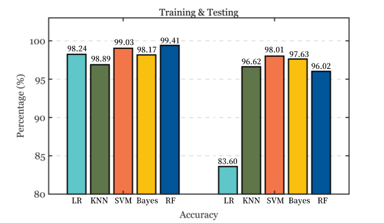
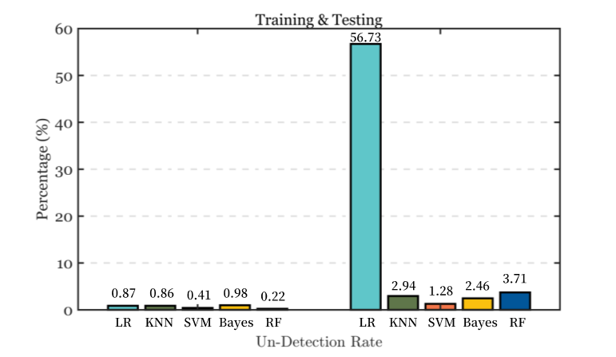

# BLEGuard Supplement

This repo is the supplemental material for the paper: [BLEGuard: Hybrid Detection Mechanism for Spoofing Attacks in Bluetooth Low Energy Networks (Student Abstract)](https://github.com/BLEGuard/supplement)

BLEGuard is a hybrid detection mechanism based on cyber-physical features judgments and machine learning techniques, which can well identify advanced spoofing attacks through offline training and online analysis. 


```
.
├─dataset				      # sample set of our data
│  ├─profiles			    # sample data of BLE device.
│  └─RSSI				      # partly RSSI feature data recorded.
├─src
│  ├─blemonitor			  # BLE device monitor code.
│  ├─machine-learning	# relative code includes: SVM, TextCNN etc.
│  └─ubertooth			  # fixed ubertooth code for additional attribution.
├─static			      	# static resource.
└─README
```

More information in [Supplement Report](https://github.com/BLEGuard/supplement/blob/master/supplement.pdf).

## Hybrid Detection Mechanism

The distinctive characteristics of advertising packets can be leveraged to discern malevolent activities within Bluetooth Low Energy (BLE) networks. The sudden fluctuations in the Used Channel Number (UCN) and Interarrival Time (INT) can be attributed to potential attack incidents. Furthermore, in order to detect sophisticated spoofing attacks, Received Signal Strength Indicator (RSSI) and Carrier Frequency Offset (CFO) are employed to establish a continuous assessment mechanism. It is important to note that the detection algorithm is presently undergoing refinement and testing. The comprehensive codebase will be made available on our [GitHub repository](https://github.com/BLEGuard/supplement) upon its finalization and validation.

The BLEGuard system is designed to strike a balance between detection accuracy and power consumption within BLE networks. As depicted in **Figure 1**, when GPU resources are insufficient, the feature judgment algorithm can be deployed online with minimal resource utilization, while reconstruction models can be invoked when precise detection is imperative. Additionally, the classification models demonstrate a high degree of reliability in identifying specific malevolent advertising packets. Preliminary experimental results have substantiated the feasibility of this approach without causing interference.


## Pre-results

We utilized the text-CNN for features extraction, and evaluated the performances of five different classifiers (SVM, KNN, Random Forest, Logistic Regression and Naïve Bayes) in package classification. **Figure 2** depicts the accuracy performance for five machine learning classifiers. Within the training phase, the Random Forest (RF) model attains the highest accuracy at 99.41%, whereas the SVM model exhibits the superior performance of 98.01% in the testing results. In terms of the accuracy metric, the discrepancies between training and testing results are marginal, with one notable exception being the Logistic Regression (LR). This observation suggests that the LR classifier underperforms in realistic testing scenario.



**Figure 3** provides a visual representation of the FAR comparison among five classifiers. In this context, FAR signifies the percentage of benign traffic incorrectly classified as malicious. Among these models, the Random Forest model exhibits the most favorable FAR of 0.01% during the training experiments, while the SVM model outperforms others with a FAR of 0.09% in the testing experiments. Nevertheless, when scrutinizing the variation between the training and testing scenarios, it becomes apparent that the Random Forest model experiences a relatively substantial increase, rising from its initial 0.01% to 0.24%. This upward shift suggests a potential instability in the model's performance when subjected to realistic testing conditions. Furthermore, the Logistic Regression model continues to exhibit suboptimal performance, registering the highest FAR of 2.47% among all models, thereby establishing itself as the least performing model in this phase.


**Figure 4** presents the performance of UND for the five models. In this stage, UND denotes the percentage of malicious traffic inaccurately classified as benign traffic. Notably, the SVM model excels in this regard, achieving the lowest UND rate at 1.28%. Following SVM, the Naïve Bayes (Bayes) model demonstrates a UND rate of 2.46%, while the K-Nearest Neighbors (KNN) model and Random Forest (RF) model exhibit UND rates of 2.94% and 3.71%, respectively. Conversely, the LR model displays a notably poor performance, recording a high UND rate of 56.73%, so we eventually removed it in from our submitted 2-page abstract.



Overall, the preliminary results unequivocally highlight the outstanding performance of the Support Vector Machine (SVM) model, with the 98.01% accuracy, 0.10% FAR, and 0.81% UND.

## Reference & License

You can find the projects we've referenced in the machine learning section at this [link](https://github.com/BLEGuard/supplement/blob/master/src/machine-learning/machine-learning.md). 
This project is licensed under the MIT license. See the [LICENSE](./LICENSE) file for details.
