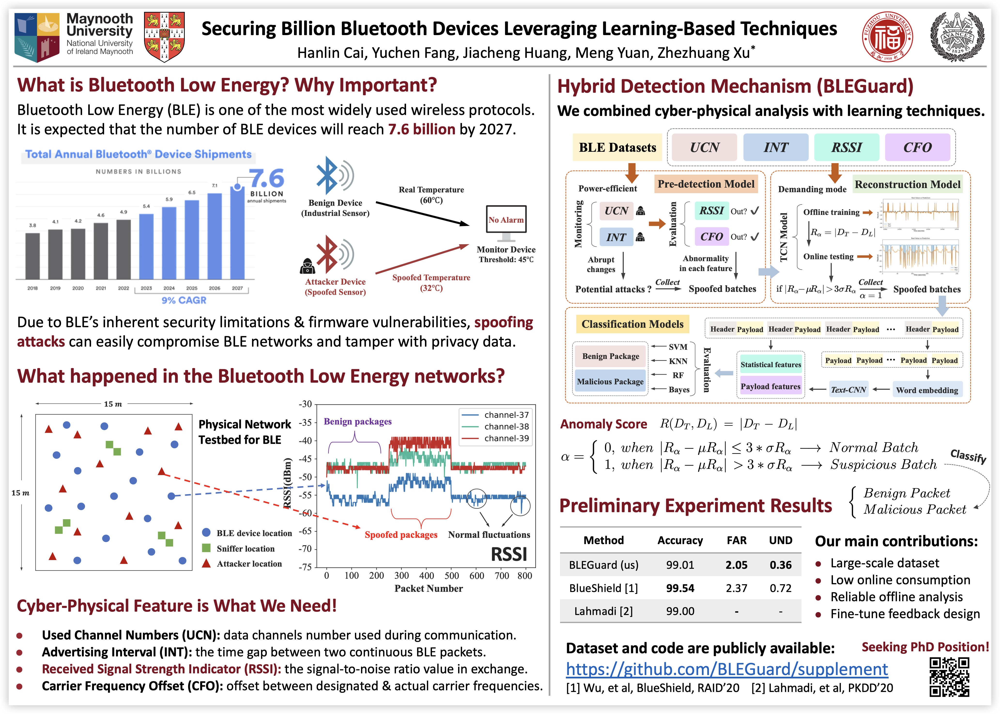

# *BLEGuard💥* for effective spoofing attack detection

As the foremost protocol for low-power communication, Bluetooth Low Energy (BLE) significantly impacts various aspects of our lives, including industry and healthcare. Given BLE’s inherent security limitations and firmware vulnerabilities, spoofing attacks can readily compromise BLE devices and jeopardize privacy data. In this paper, we introduce ***[BLEGuard](https://scholar.google.com.hk/scholar?hl=zh-CN&as_sdt=0%2C5&q=BLEGuard:%20Hybrid%20Detection%20Mechanism%20for%20Spoofing%20Attacks%20in%20Bluetooth%20Low%20Energy%20Networks&btnG=BLEGuard:%20Hybrid%20Detection%20Mechanism%20for%20Spoofing%20Attacks%20in%20Bluetooth%20Low%20Energy%20Networks)***💥, a hybrid mechanism for detecting spoofing attacks in BLE networks. We established a physical Bluetooth system to conduct attack simulations and construct a substantial dataset (***[BLE-SAD](https://github.com/BLEGuard/supplement/tree/master/dataset/BLE-SAD)***😭). BLEGuard integrates pre-detection, reconstruction, and classification models to effectively identify spoofing activities, achieving an impressive preliminary accuracy of 99.01%, with a false alarm rate of 2.05% and an undetection rate of 0.36%.

**Our Github repo contain the following code and data:**


```tex
.
├─dataset               # sample set of our dataset.
│  ├─profiles           # sample data of BLE device.
│  └─BLE-SAD            # large-scale BLE network packets.
│  └─Android_tool_app   # Android app for automatic data collection.
├─src
│  ├─blemonitor         # BLE device monitoring program.
│  ├─machine-learning   # relative code for our learning model.
│  └─ubertooth          # fixed ubertooth code for additional attribution.
├─static                # static resource.
└─README                # the document you are reading now :D
└─BLEGuard_paper.pdf    # paper submitted to MobiSys 2024
└─BLEGuard_poster.pptx  # poster for BLEGuard and BLE-SAD
```

## Our Poster for incoming conference

<left>
  
</left>

## Reference & License

You can find the projects we've referenced in the machine learning section at this [link](https://github.com/BLEGuard/supplement/blob/master/src/machine-learning/machine-learning.md).

This project is licensed under the MIT license. See the [LICENSE](./LICENSE) file for details.

## Acknowledgments🥰

This project was supported by the Chinese National Undergraduate Innovation Training Program (No. 202310386056) and AAAI 2024 Undergraduate Consortium Scholarship. The authors gratefully acknowledge Dr. Tozammel Hossain, Dr. Jason Grant and Dr. Qifeng Lin for their generous suggestions.

## Our preprint📝

```tex
@techreport{cai2024bleguard,
  title={BLEGuard: Hybrid Detection Mechanism for Spoofing Attacks in Bluetooth Low Energy Networks},
  author={Cai, Hanlin and Fang, Yuchen and Huang, Jiacheng and Yuan, Meng and Xu, Zhezhuang},
  year={2024},
  institution={EasyChair}
}
```
