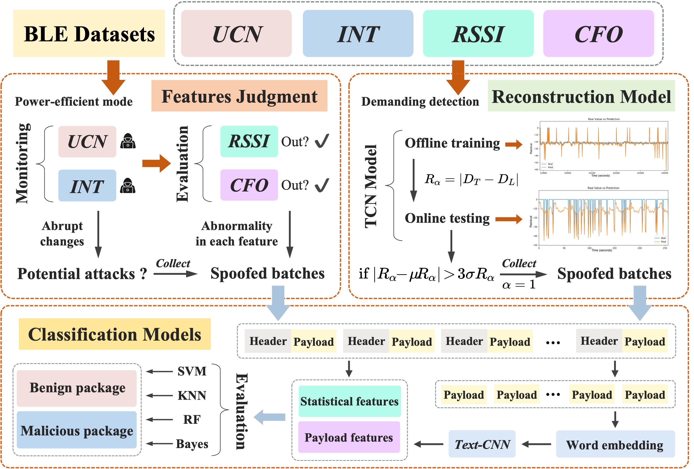

# BLEGuard Supplement

This repo is the supplemental material for BLEGuard project.

BLEGuard is a hybrid detection mechanism based on cyber-physical features judgments and machine learning techniques, which can well identify advanced spoofing attacks through offline training and online analysis. 

More information in [Supplement Report](https://github.com/BLEGuard/supplement/blob/master/supplement.pdf).


```
.
├─dataset               # sample set of our data
│  ├─profiles           # sample data of BLE device.
│  └─RSSI               # partly RSSI feature data recorded.
├─src
│  ├─blemonitor         # BLE device monitor code.
│  ├─machine-learning   # relative code includes: SVM, TextCNN etc.
│  └─ubertooth          # fixed ubertooth code for additional attribution.
├─static                # static resource.
└─README
```

## Hybrid Detection Mechanism

The distinctive characteristics of advertising packets can be leveraged to discern malevolent activities within Bluetooth Low Energy (BLE) networks. The sudden fluctuations in the Used Channel Number (UCN) and Interarrival Time (INT) can be attributed to potential attack incidents. Furthermore, in order to detect sophisticated spoofing attacks, Received Signal Strength Indicator (RSSI) and Carrier Frequency Offset (CFO) are employed to establish a continuous assessment mechanism. It is important to note that the detection algorithm is presently undergoing refinement and testing. The comprehensive codebase will be made available on our [GitHub repository](https://github.com/BLEGuard/supplement) upon its finalization and validation.

The BLEGuard system is designed to strike a balance between detection accuracy and power consumption within BLE networks. As depicted in **Figure 1**, when GPU resources are insufficient, the feature judgment algorithm can be deployed online with minimal resource utilization, while reconstruction models can be invoked when precise detection is imperative. Additionally, the classification models demonstrate a high degree of reliability in identifying specific malevolent advertising packets. Preliminary experimental results have substantiated the feasibility of this approach without causing interference.

<left>
  
</left>

## Reference & License

You can find the projects we've referenced in the machine learning section at this [link](https://github.com/BLEGuard/supplement/blob/master/src/machine-learning/machine-learning.md). 

This project is licensed under the MIT license. See the [LICENSE](./LICENSE) file for details.
